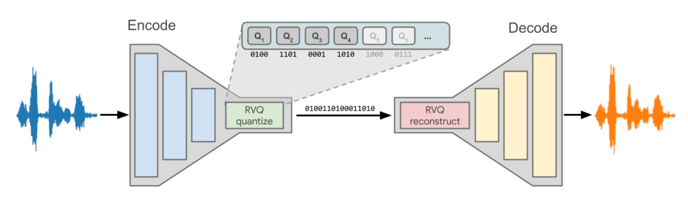

# SoundStream



This repository contains a PyTorch implementation of the [SoundStream](https://arxiv.org/abs/2107.03312) audio codec. The codec uses a neural net to encode and decode audio.

<a target="_blank" href="https://colab.research.google.com/github/yakuri354/soundstream/inference.ipynb">
  
</a>

### Notes
- Denoising is not yet implemented
- Bitrate/Quantizer dropout is not implemented. The model currently only supports 16kHz audio.
- Convolution strides are modified to preserve the original bitrate for 16kHz. (The original SoundStream paper targets 24kHz audio)
- The provided checkpoints are not representative of the SoundStream model as there was too little training data and the training process was not carried out to convergence. The model will likely perform much better if trained for at least 1M steps on a larger dataset.

## Installation

The primary tool for managing dependencies is `uv`. If it's not installed in your environment, refer [here](https://docs.astral.sh/uv/getting-started/installation/).

To set up a working environment, run:

```bash
git clone https://github.com/yakuri354/soundstream.git
cd soundstream
uv sync
```

Depending on your system, `uv` may need to compile native libraries. In this case you should have `build-essential` and `ffmpeg` installed.

## Inference

The model weights are uploaded to HuggingFace [here](https://huggingface.co/yakuri354-2/soundstream). The repo includes the final pretrained checkpoint (main branch) as well as intermediate partially trained checkpoints (i.e. epoch4 branch).

The model can be loaded using HF Hub.

```python
from src.model.soundstream import SoundStream
model = SoundStream.from_pretrained("yakuri354-2/soundstream")

outputs = model(audio)
```

The model runs reasonably well on a CPU (albeit not in real time).

The repo includes an inference notebook that encodes and decoded a sample speech recording.

The easiest way to test the model is to run the notebook in Google Colab.

<a target="_blank" href="https://colab.research.google.com/github/yakuri354/soundstream/inference.ipynb">
  
</a>


To run the notebook locally, you can use `uv`. In this case you need to remove the cells that clone this repository and install dependencies.

```bash
uv run --with jupyter jupyter lab
# Open JupyterLab with your browser
```

## Training

The final checkpoint was trained for approx. 40k steps on LibriSpeech `train-clean-100`.

To reproduce the same training procedure, simply clone the repo, log into W&B and run the training script.

```bash
uv run wandb login # Log into wandb, optional if you disable logging
uv run train.py
```
